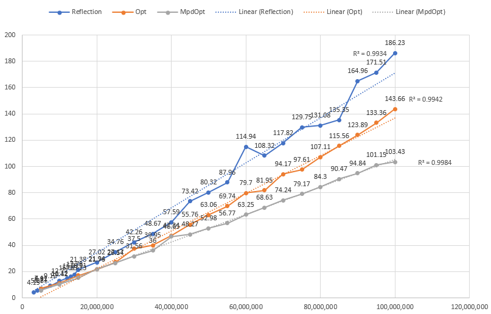

# ParallelProcessing

## 平行處理資料載入/寫入速度

# 測量設備

## CPU: 13th Gen Intel(R) Core(TM) i5-13420H 2.1GHz

## Threads: 12

## P-Core: 4 E-Core: 4

## RAM 40GB

順便看一下最終消耗的記憶體用量

### 實驗 0(循序讀取和寫入秒數) (Before optimize CSV I/O input)：

| 筆數       | 讀取秒數(s) | 寫入讀取秒數(s) | 總完成時間(s) | 記憶體用量(mb) |
| ---------- | ----------- | --------------- | ------------- | -------------- |
| 10,000     | 0.032       | 5.5             | 5.532         | 24             |
| 50,000     | 0.273       | 21.704          | 21.977        | 42             |
| 100,000    | 0.434       | 40.606          | 41.04         | 63             |
| 200,000    | 1.045       | 89.688          | 90.733        | 104            |
| 500,000    | 2.214       | 191.132         | 193.346       | 226            |
| 1,000,000  | 4.148       | 354.943         | 359.091       | 427            |
| 2,000,000  | 7.905       | 743.976         | 751.881       | 845            |
| 3,000,000  |             |                 |               |                |
| 4,000,000  |             |                 |               |                |
| 5,000,000  |             |                 |               |                |
| 7,500,000  |             |                 |               |                |
| 10,000,000 |             |                 |               |                |
| 12,000,000 |             |                 |               |                |
| 13,000,000 |             |                 |               |                |
| 14,000,000 |             |                 |               |                |
| 15,000,000 |             |                 |               |                |

### 實驗 1(循序讀取和寫入秒數) (After optimize CSV I/O input)：

| 筆數       | 讀取秒數(s) | 寫入讀取秒數(s) | 總完成時間(s) | 記憶體用量(mb) |
| ---------- | ----------- | --------------- | ------------- | -------------- |
| 10,000     | 0.032       | 0.044           | 0.074         | 24             |
| 50,000     | 0.174       | 0.092           | 0.266         | 42             |
| 100,000    | 0.398       | 0.137           | 0.535         | 63             |
| 200,000    | 0.795       | 0.299           | 1.094         | 104            |
| 500,000    | 2.217       | 0.526           | 2.673         | 226            |
| 1,000,000  | 4.314       | 0.993           | 5.307         | 433            |
| 2,000,000  | 7.067       | 2.049           | 9.116         | 845            |
| 3,000,000  | 10.604      | 3.156           | 13.76         | 1200           |
| 4,000,000  | 13.967      | 4.383           | 18.35         | 1600           |
| 5,000,000  | 16.997      | 5.604           | 22.601        | 2000           |
| 7,500,000  | 32.737      | 8.23            | 40.967        | 3000           |
| 10,000,000 |             |                 |               |                |
| 12,000,000 |             |                 |               |                |
| 13,000,000 |             |                 |               |                |
| 14,000,000 |             |                 |               |                |
| 15,000,000 |             |                 |               |                |

### 實驗 2(循序讀取和寫入秒數) (After optimize Batch CSV I/O input)：

#### Median

| 批次數量  | 筆數      | 讀取秒數(s) | 寫入讀取秒數(s) | 總完成時間(s) | 記憶體用量(mb) |
| --------- | --------- | ----------- | --------------- | ------------- | -------------- |
| 1,000,000 | 5,000,000 | 3.83        | 1.44            | 25.31         | 718            |
| 1,500,000 | 5,000,000 | 4.2         | 1.67            | 22.98         | 970            |
| 2,000,000 | 5,000,000 | 5.36        | 2.17            | 20.1          | 951            |
| 2,500,000 | 5,000,000 | 6.8         | 2.79            | 19.18         | 1.2G           |
| 3,000,000 | 5,000,000 | 9.14        | 3.03            | 24.35         | 1.2G           |
| 3,500,000 | 5,000,000 | 7.85        | 3.15            | 22            | 1.2G           |
| 4,000,000 | 5,000,000 | 7.62        | 3.2             | 21.65         | 1.1G           |
| 4,500,000 | 5,000,000 | 6.73        | 2.73            | 18.92         | 1.2G           |
| 5,000,000 | 5,000,000 | 15.3        | 6.75            | 22.05         | 1.2G           |

| 批次數量   | 筆數       | 讀取秒數(s) | 寫入讀取秒數(s) | 總完成時間(s) | 記憶體用量(mb) |
| ---------- | ---------- | ----------- | --------------- | ------------- | -------------- |
| 1,000,000  | 10,000,000 | 4.22        | 1.4             | 54.66         | 718            |
| 1,500,000  | 10,000,000 | 4.01        | 1.48            | 39.64         | 1G             |
| 2,000,000  | 10,000,000 | 6.93        | 2.77            | 47.4          | 1.4G           |
| 2,500,000  | 10,000,000 | 6.67        | 2.73            | 39.67         | 1.8G           |
| 3,000,000  | 10,000,000 | 7.54        | 3.1             | 38.39         | 1.6G           |
| 3,500,000  | 10,000,000 | 9.07        | 4.77            | 44.95         | 1.8G           |
| 4,000,000  | 10,000,000 | 16.62       | 6.75            | 60.86         | 2.1G           |
| 4,500,000  | 10,000,000 | 13.42       | 4.88            | 43.7          | 2.1G           |
| 5,000,000  | 10,000,000 | 18.74       | 7.02            | 51.53         | 2.3G           |
| 5,500,000  | 10,000,000 | 16.88       | 6.54            | 46.86         | 2.3G           |
| 6,000,000  | 10,000,000 | 18.78       | 6.42            | 50.41         | 2.3G           |
| 6,500,000  | 10,000,000 | 19.64       | 7.75            | 54.78         | 2.3G           |
| 7,000,000  | 10,000,000 | 19.79       | 7.82            | 55.22         | 2.3G           |
| 7,500,000  | 10,000,000 | 15.38       | 6.04            | 42.84         | 2.3G           |
| 8,000,000  | 10,000,000 | 15.53       | 6.29            | 43.64         | 2.3G           |
| 8,500,000  | 10,000,000 | 17.26       | 8               | 50.5          | 2.3G           |
| 9,000,000  | 10,000,000 | 13.84       | 5.2             | 38.07         | 2.3G           |
| 9,500,000  | 10,000,000 | 19.89       | 12.26           | 64.3          | 2.3G           |
| 10,000,000 | 10,000,000 | 29.61       | 24.86           | 54.48         | 2.3G           |

### 實驗 3(循序讀取和寫入秒數) (After optimize Asynchronous Batch CSV I/O input)：

#### Asynchronous

| 批次數量  | 筆數       | 讀取秒數(s) | 寫入讀取秒數(s) | 總完成時間(s) | 記憶體用量(mb) |
| --------- | ---------- | ----------- | --------------- | ------------- | -------------- |
| 2,500,000 | 3,000,000  | 5.04        | 1.87            | 10.04         | 653            |
| 2,500,000 | 4,000,000  | 7.1         | 2.42            | 10.61         | 976            |
| 2,500,000 | 5,000,000  | 9.68        | 2.9             | 12.9          | 1.2            |
| 2,500,000 | 7,500,000  | 14.5        | 4.87            | 19.57         | 1.8            |
| 2,500,000 | 10,000,000 | 15.38       | 6.25            | 22.52         | 2.2G           |
| 2,500,000 | 12,000,000 | 19.27       | 6.73            | 27.01         | 2.6G           |
| 2,500,000 | 13,000,000 | 23.01       | 6.66            | 33.06         | 2.8G           |
| 2,500,000 | 14,000,000 | 28.19       | 8.68            | 40.03         | 3.2G           |
| 2,500,000 | 15,000,000 | 28.99       | 11.82           | 45.91         | 3.4G           |

### 實驗 4(循序讀取和寫入秒數) (After optimize Asynchronous lock Batch CSV I/O input)：

#### Asynchronous (Task.Run)

##### lock to single file

| 批次數量  | 筆數       | 讀取秒數(s) | 寫入讀取秒數(s) | 總完成時間(s) | 記憶體用量(mb) |
| --------- | ---------- | ----------- | --------------- | ------------- | -------------- |
| 2,500,000 | 3,000,000  | 5.05        | 1.79            | 9.74          | 655            |
| 2,500,000 | 4,000,000  | 6.85        | 2.68            | 10.86         | 966            |
| 2,500,000 | 5,000,000  | 8.78        | 4.16            | 14.44         | 1.2G           |
| 2,500,000 | 7,500,000  | 11.42       | 5.09            | 19.28         | 1.7G           |
| 2,500,000 | 10,000,000 | 15.32       | 7.95            | 27.46         | 2.3G           |
| 2,500,000 | 12,000,000 | 19.07       | 10.9            | 37.3          | 2.7G           |
| 2,500,000 | 13,000,000 | 19.31       | 11.7            | 38.07         | 2.9G           |
| 2,500,000 | 14,000,000 | 21.22       | 14.18           | 43.3          | 3.2G           |
| 2,500,000 | 15,000,000 | 25.01       | 20.64           | 55.67         | 3.3G           |

### 實驗 5(循序讀取和寫入秒數) (After optimize Asynchronous wait one Batch CSV I/O input)：

#### Asynchronous (Task.Run)

##### Wait one to single file

| 批次數量  | 筆數       | 讀取秒數(s) | 寫入讀取秒數(s) | 總完成時間(s) | 記憶體用量(mb) |
| --------- | ---------- | ----------- | --------------- | ------------- | -------------- |
| 2,500,000 | 3,000,000  | 4.95        | 1.73            | 9.55          | 655            |
| 2,500,000 | 4,000,000  | 7.01        | 2.76            | 11.14         | 954            |
| 2,500,000 | 5,000,000  | 9.17        | 4.22            | 14.88         | 1.2G           |
| 2,500,000 | 7,500,000  | 11.73       | 4.86            | 19.26         | 1.8G           |
| 2,500,000 | 10,000,000 | 14.16       | 8.28            | 29.45         | 2.3G           |
| 2,500,000 | 12,000,000 | 18.18       | 8.67            | 34.02         | 2.8G           |
| 2,500,000 | 13,000,000 | 20.15       | 9.92            | 39.38         | 2.9G           |
| 2,500,000 | 14,000,000 | 22.3        | 13.17           | 41.77         | 3.1G           |
| 2,500,000 | 15,000,000 | 23.28       | 17.51           | 55.28         | 3.4G           |

### 實驗 6(循序讀取和寫入秒數) (After optimize Asynchronous SemaphoreSlim Batch CSV I/O input)：

#### Asynchronous (Task.Run)

##### SemaphoreSlim to single file

| 批次數量  | 筆數       | 讀取秒數(s) | 寫入讀取秒數(s) | 總完成時間(s) | 記憶體用量(mb) |
| --------- | ---------- | ----------- | --------------- | ------------- | -------------- |
| 2,500,000 | 3,000,000  | 6.97        | 2.4             | 13.21         | 655            |
| 2,500,000 | 4,000,000  | 7.05        | 2.77            | 11.21         | 958            |
| 2,500,000 | 5,000,000  | 12.24       | 4               | 17.66         | 1.2G           |
| 2,500,000 | 7,500,000  | 11.85       | 4.7             | 19.31         | 1.8G           |
| 2,500,000 | 10,000,000 | 15.79       | 9.17            | 29.05         | 2.3G           |
| 2,500,000 | 12,000,000 | 20.58       | 12.39           | 37.82         | 2.6G           |
| 2,500,000 | 13,000,000 | 19.51       | 12.35           | 40.16         | 2.9G           |
| 2,500,000 | 14,000,000 | 22.66       | 13.92           | 43.64         | 3.2G           |
| 2,500,000 | 15,000,000 | 24.26       | 19.44           | 52.9          | 3.4G           |

### 實驗 7(循序讀取和寫入秒數) (After optimize Asynchronous lock Batch CSV I/O input)：

#### Asynchronous (Parallel.ForAsync)

##### lock to single file

##### reflection read/write

| 批次數量  | 筆數        | 讀取秒數(s) | 寫入讀取秒數(s) | 總完成時間(s) | 記憶體用量(mb) |
| --------- | ----------- | ----------- | --------------- | ------------- | -------------- |
| 2,500,000 | 3,000,000   | 2.33        | 0.85            | 4.15          | 904            |
| 2,500,000 | 4,000,000   | 3.32        | 1.5             | 5.38          | 1.4G           |
| 2,500,000 | 5,000,000   | 4.46        | 1.86            | 6.92          | 1.8G           |
| 2,500,000 | 7,500,000   | 5.61        | 2.39            | 9.12          | 2.7G           |
| 2,500,000 | 10,000,000  | 8.23        | 3.12            | 12.77         | 3.5G           |
| 2,500,000 | 12,000,000  | 9.58        | 3.53            | 15.01         | 4.1G           |
| 2,500,000 | 13,000,000  | 10.13       | 4.07            | 16.32         | 4.4G           |
| 2,500,000 | 14,000,000  | 10.99       | 5.12            | 17.78         | 4.7G           |
| 2,500,000 | 15,000,000  | 13.1        | 5.33            | 21.38         | 5.1G           |
| 2,500,000 | 20,000,000  | 16.98       | 6.83            | 27.02         | 6.7G           |
| 2,500,000 | 25,000,000  | 20.11       | 8.2             | 34.76         | 8.2G           |
| 2,500,000 | 30,000,000  | 24.21       | 10.22           | 42.26         | 9.9G           |
| 2,500,000 | 35,000,000  | 21.96       | 14.65           | 48.67         | 10.9G          |
| 2,500,000 | 40,000,000  | 23.04       | 13.97           | 57.59         | 10.9G          |
| 2,500,000 | 45,000,000  | 26.88       | 13.62           | 73.42         | 10.9G          |
| 2,500,000 | 50,000,000  | 25.37       | 15.09           | 80.32         | 11.2G          |
| 2,500,000 | 55,000,000  | 24.28       | 15.08           | 87.96         | 11.1G          |
| 2,500,000 | 60,000,000  | 26.54       | 15.34           | 114.94        | 11.6G          |
| 2,500,000 | 65,000,000  | 26.58       | 16.99           | 108.32        | 11.4G          |
| 2,500,000 | 70,000,000  | 25.43       | 17.31           | 117.82        | 11.7G          |
| 2,500,000 | 75,000,000  | 28.19       | 17.12           | 129.75        | 11.5G          |
| 2,500,000 | 80,000,000  | 28.39       | 17.19           | 131.08        | 13.6G          |
| 2,500,000 | 85,000,000  | 25.54       | 13.65           | 135.35        | 15.9G          |
| 2,500,000 | 90,000,000  | 30.16       | 11.6            | 164.96        | 10.3G          |
| 2,500,000 | 95,000,000  | 31.54       | 14.23           | 171.51        | 10.3G          |
| 2,500,000 | 100,000,000 | 32.68       | 11.6            | 186.23        | 11.1G          |

### 實驗 8(循序讀取和寫入秒數) (After optimize Asynchronous SemaphoreSlim Batch CSV I/O input)：

#### Asynchronous (Task.Run)

##### SemaphoreSlim to single file

##### MPDIndex Read accelerate

| 批次數量  | 筆數       | 讀取秒數(s) | 寫入讀取秒數(s) | 總完成時間(s) | 記憶體用量(mb) |
| --------- | ---------- | ----------- | --------------- | ------------- | -------------- |
| 2,500,000 | 7,500,000  | 9.71        | 4.63            | 16.64         | 1.8G           |
| 2,500,000 | 8,000,000  | 10.38       | 3.63            | 17.65         | 1.8G           |
| 2,500,000 | 9,000,000  | 11.65       | 4.47            | 18.93         | 2.1G           |
| 2,500,000 | 10,000,000 | 12.89       | 9.45            | 26.08         | 2.3G           |
| 2,500,000 | 12,000,000 | 15.21       | 10.26           | 30.34         | 2.7G           |
| 2,500,000 | 13,000,000 | 16.3        | 11.45           | 34.09         | 2.9G           |
| 2,500,000 | 14,000,000 | 18.32       | 11.75           | 36.67         | 3.2G           |

### 實驗 9(循序讀取和寫入秒數) (After optimize Asynchronous lock Batch CSV I/O input)：

#### Asynchronous (Parallel.ForAsync)

##### lock to single file

##### MPDIndex Read accelerate

#### Optimize Write

| 批次數量  | 筆數       | 讀取秒數(s) | 寫入讀取秒數(s) | 總完成時間(s) | 記憶體用量(mb) |
| --------- | ---------- | ----------- | --------------- | ------------- | -------------- |
| 2,500,000 | 3,000,000  | 2.99        | 0.79            | 5.29          | 898            |
| 2,500,000 | 4,000,000  | 3.41        | 1.01            | 4.85          | 1.4G           |
| 2,500,000 | 5,000,000  | 4.39        | 1.35            | 6.13          | 1.70           |
| 2,500,000 | 7,500,000  | 5.88        | 1.58            | 8.37          | 2.6G           |
| 2,500,000 | 10,000,000 | 8.76        | 2.21            | 12.22         | 3.5G           |
| 2,500,000 | 12,000,000 | 9.93        | 2.26            | 13.02         | 4.2G           |
| 2,500,000 | 13,000,000 | 9.59        | 2.01            | 13.5          | 4.6G           |
| 2,500,000 | 14,000,000 | 11.4        | 2.65            | 15.54         | 4.9G           |
| 2,500,000 | 15,000,000 | 10.48       | 3.53            | 16.02         | 5.2G           |
| 2,500,000 | 35,000,000 | 23.82       | 9.37            | 39.08         | 12.6G          |

### 實驗 10(循序讀取和寫入秒數) (After optimize Asynchronous lock Batch CSV I/O input)：

#### Asynchronous (Parallel.ForAsync)

##### lock to single file

##### Optimize Read/Write delegate getter/setter

| 批次數量  | 筆數        | 讀取秒數(s) | 寫入讀取秒數(s) | 總完成時間(s) | 記憶體用量(mb) |
| --------- | ----------- | ----------- | --------------- | ------------- | -------------- |
| 2,500,000 | 5,000,000   | 4.93        | 1.57            | 7.11          | 1.8G           |
| 2,500,000 | 10,000,000  | 7.54        | 2.35            | 11.12         | 3.6G           |
| 2,500,000 | 15,000,000  | 11.32       | 3.47            | 16.91         | 5.2G           |
| 2,500,000 | 20,000,000  | 13.03       | 4.56            | 21.76         | 6.6G           |
| 2,500,000 | 25,000,000  | 19.48       | 3.92            | 27.17         | 7G             |
| 2,500,000 | 30,000,000  | 19.46       | 7.07            | 37.5          | 8.7G           |
| 2,500,000 | 35,000,000  | 22.9        | 7.94            | 39.95         | 8.7G           |
| 2,500,000 | 40,000,000  | 20.79       | 11.95           | 47.34         | 11.8G          |
| 2,500,000 | 45,000,000  | 24.12       | 9.66            | 55.76         | 9.8G           |
| 2,500,000 | 50,000,000  | 24.87       | 7.8             | 63.06         | 10.8G          |
| 2,500,000 | 55,000,000  | 21.03       | 11.95           | 69.74         | 14.9G          |
| 2,500,000 | 60,000,000  | 27.13       | 7.34            | 79.7          | 10.5G          |
| 2,500,000 | 65,000,000  | 26.86       | 7.83            | 81.95         | 8.2G           |
| 2,500,000 | 70,000,000  | 27.18       | 7.06            | 94.17         | 9.7G           |
| 2,500,000 | 75,000,000  | 27.08       | 8.35            | 97.61         | 9.3G           |
| 2,500,000 | 80,000,000  | 29.66       | 5.95            | 107.11        | 9.9G           |
| 2,500,000 | 85,000,000  | 28.4        | 7.12            | 115.56        | 9.6G           |
| 2,500,000 | 90,000,000  | 29.51       | 6.93            | 123.89        | 9.6G           |
| 2,500,000 | 95,000,000  | 28.93       | 5.47            | 133.36        | 10.7G          |
| 2,500,000 | 100,000,000 | 31.59       | 4.93            | 143.66        | 10.4G          |

### 實驗 11(循序讀取和寫入秒數) (After optimize Asynchronous lock Batch CSV I/O input)：

#### Asynchronous (Parallel.ForAsync)

##### lock to single file

##### MPDIndex Read accelerate

##### Optimize Read/Write delegate getter/setter

| 批次數量  | 筆數        | 讀取秒數(s) | 寫入讀取秒數(s) | 總完成時間(s) | 記憶體用量(mb) |
| --------- | ----------- | ----------- | --------------- | ------------- | -------------- |
| 2,500,000 | 5,000,000   | 4.08        | 1.24            | 5.71          | 1.7G           |
| 2,500,000 | 10,000,000  | 7.17        | 2.02            | 10.42         | 3.5G           |
| 2,500,000 | 15,000,000  | 9.88        | 3.16            | 15.23         | 5.2G           |
| 2,500,000 | 20,000,000  | 14.99       | 3.98            | 21.94         | 7G             |
| 2,500,000 | 25,000,000  | 18.49       | 4.45            | 26.54         | 8.7G           |
| 2,500,000 | 30,000,000  | 22.07       | 5.12            | 31.56         | 10.4G          |
| 2,500,000 | 35,000,000  | 22.15       | 8.33            | 36            | 12.3G          |
| 2,500,000 | 40,000,000  | 22.02       | 11.6            | 46.65         | 14G            |
| 2,500,000 | 45,000,000  | 22.02       | 11.66           | 48.27         | 15.9G          |
| 2,500,000 | 50,000,000  | 21.68       | 14.24           | 52.98         | 16G            |
| 2,500,000 | 55,000,000  | 22.17       | 14.07           | 56.77         | 15.9G          |
| 2,500,000 | 60,000,000  | 15.07       | 11.79           | 63.25         | 16.1G          |
| 2,500,000 | 65,000,000  | 13.34       | 13.73           | 68.63         | 17G            |
| 2,500,000 | 70,000,000  | 10.44       | 17.79           | 74.24         | 17.7G          |
| 2,500,000 | 75,000,000  | 11.76       | 16.38           | 79.17         | 17.7           |
| 2,500,000 | 80,000,000  | 7.72        | 18.27           | 84.3          | 17.4G          |
| 2,500,000 | 85,000,000  | 11.54       | 15.77           | 90.47         | 18G            |
| 2,500,000 | 90,000,000  | 9.59        | 15.34           | 94.84         | 21G            |
| 2,500,000 | 95,000,000  | 10.31       | 19.27           | 101.15        | 17.9G          |
| 2,500,000 | 100,000,000 | 8.19        | 17.36           | 103.43        | 17.8G          |

### R-Squared

#### 程式優化目標

1. **確保線性擴展能力（斜率平滑）**：降低資料量級增加時帶來的效能波動
2. **提升系統可預測性（高 $R^2$ 值）**：確保執行時間能精準量化與預估

#### 實驗說明 (Trials 7, 10, 11)

針對一億筆巨量資料的處理，測試了三種不同的實作方式，觀察其處理耗時與資料量增長之間的關係：

1. **純 Reflection (SetValue / GetValue)**

- **表現**：處理過程中耗時波動較大，曲線容易偏離線性趨勢中線。
- **結論**：在大資料量下的執行時間難以預測，效能極不穩定。

2. **動態委派 Delegate (Setter / Getter)**

- **表現**：整體處理速度更快，斜率也較 Reflection 平滑。
- **結論**：雖然效能顯著提升，但根據決定係數（$R^2$）顯示，當資料量逼近一億筆時，耗時仍開始出現發散與偏離趨勢線的現象。

3. **MPD 搭配 Delegate**

- **表現**：三者中表現最優，耗時增長的斜率最為平滑。
- **結論**：$R^2$ 值（0.9984）最貼近完美線性，完美貼齊趨勢中線，展現極高的穩定度。

---

#### 總結與架構實務價值

雖然上述三種方案最終皆能消化一億筆的巨量資料，但 **MPD 搭配 Delegate** 的高 $R^2$ 表現，證實了其具備最佳的架構彈性。另外兩種方案在資料量達到極值時的曲線偏離，意味著系統在後期已觸及隱性的效能瓶頸（如：記憶體配置壓力、GC 負擔、或底層硬體 I/O 限制）。

**高 $R^2$（貼齊中線）在系統工程上的意義：**
在預估程式的極限處理能力時，MPD 方案能提供最具參考價值的基準線（Baseline）。它不僅單純提升了程式的執行效能與可預測性，更為現實生產環境（Production）中的架構決策提供了可靠的量化依據。這些數據能直接應用於：

- **硬體資源容量規劃（Capacity Planning）**：精準評估實體機器的規格需求與乘載上限。
- **分區與批次策略（Data Partitioning / Chunking）**：作為決定資料切片大小與平行處理策略的科學依據。
- **執行時間預估（Time Estimation & SLA）**：提供更精確的批次作業時間預估，有效規避系統 Timeout 風險。

---

### 優化項目 1-1(Read): 單純使用 Split & Span

| Method       |     Mean |   Error |  StdDev |   Gen0 | Allocated |
| ------------ | -------: | ------: | ------: | -----: | --------: |
| Read         | 180.6 ns | 3.48 ns | 3.09 ns | 0.1099 |     577 B |
| OptimizeRead | 594.8 ns | 1.85 ns | 1.73 ns | 0.0496 |     260 B |

### 優化項目 1-2(Read): 單純使用 Split & Span & Reflection

| Method       |       Mean |     Error |    StdDev |     Median |   Gen0 | Allocated |
| ------------ | ---------: | --------: | --------: | ---------: | -----: | --------: |
| Read         |   979.8 ns |   7.35 ns |   6.51 ns |   979.1 ns | 0.1583 |     837 B |
| OptimizeRead | 1,677.9 ns | 118.16 ns | 348.40 ns | 1,474.5 ns | 0.0992 |     521 B |

### 優化項目 1-3(Read): 單純使用 Split & Span & Reflection & Static

| Method       |     Mean |   Error |  StdDev |   Gen0 | Allocated |
| ------------ | -------: | ------: | ------: | -----: | --------: |
| Read         | 983.7 ns | 5.72 ns | 4.78 ns | 0.1583 |     837 B |
| OptimizeRead | 776.4 ns | 3.85 ns | 3.60 ns | 0.0572 |     304 B |

### 優化項目 1-4(Read): 單純使用 Split & Span & Reflection & Static & Delegate

| Method       |     Mean |    Error |   StdDev |   Median |   Gen0 | Allocated |
| ------------ | -------: | -------: | -------: | -------: | -----: | --------: |
| Read         | 954.5 ns | 12.62 ns | 11.18 ns | 955.0 ns | 0.1583 |     837 B |
| OptimizeRead | 228.1 ns | 16.59 ns | 48.91 ns | 251.8 ns | 0.0212 |     112 B |

### 優化項目 1-5(Read): 單純使用 Split & Span & Reflection & Static & Delegate & Direct Set Value

| Method       |     Mean |    Error |   StdDev |   Gen0 | Allocated |
| ------------ | -------: | -------: | -------: | -----: | --------: |
| Read         | 961.0 ns | 16.25 ns | 14.41 ns | 0.1583 |     837 B |
| OptimizeRead | 115.3 ns |  1.23 ns |  1.09 ns | 0.0143 |      76 B |
